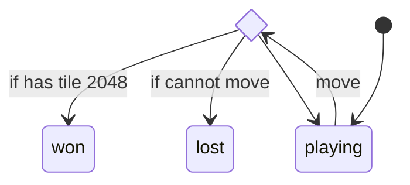
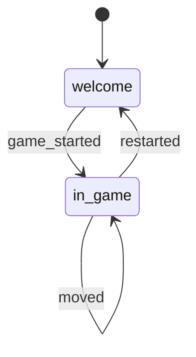

# 2048

Yet another 2048 implementation.

TL:DR; [🎮 Play here!](https://fgandellini.github.io/2048/)

## Before you start

This project uses the following tools:

- [nvm](https://github.com/nvm-sh/nvm) to manage node/npm version
- [npm workspaces](https://docs.npmjs.com/cli/v7/using-npm/workspaces) to organize packages
- [Vitest](https://vitest.dev/) to run `@2024/game-engine` tests
- [React](https://react.dev/) to build the UI for the game `@2048/react`
- [Jest](https://jestjs.io/) and [Testing Library](https://testing-library.com/) to test the React application
- [GitHub Action](https://github.com/features/actions) to test and deploy the application
- [GitHub Pages](https://pages.github.com/) to host the application

## 📑 Getting started

The project has been tested on Linux only.

1. Ensure you have `nvm` [installed](https://github.com/nvm-sh/nvm?tab=readme-ov-file#installing-and-updating) on your computer.

2. clone this repository and `cd` into it

3. run `nvm install` to install the correct node version (specified in `.nvmrc`)

4. run `npm start` to install dependencies and start the development server

5. navigate to http://localhost:1234

## 🏗️ Project Structure

The project is organized into two main parts:

1. `packages/game-engine`: the core library that manages the game/board state.
2. `apps/react`: a React application that uses `@2048/game-engine`, it manages the app state.

The project is built with a focus on state machines and immutability.

This is the main game state machine implemented by `packages/game-engine`:



The machine starts in a `playing` state.

When it receives the `move` action, it checks if the game is won or lost and transitions to the appropriate state. If the game is neither won nor lost, it remains in the `playing` state and updates the board moving the tiles in the direction specified by the action and adding a new tile with a value of 1.

## 🕹️ Gameplay

The game starts with a Welcome screen where the user can select the game theme, the board size and the number of obstacles to place on the board.


Once the user hits the `Start Game!` button, the game starts and loads the Board screen.

Here the user can play using the arrow keys on the keyboard.


The goal of the game is to reach the 2048 tile by combining tiles with the same value. The user can move the tiles in four directions: up, down, left, and right. When the user moves the tiles, the game engine updates the board by moving the tiles in the specified direction and adding a new tile with a value of 1.

The user can go back to the Welcome screen by clicking the `I'm a loser` button.

If the user reaches the 2048 tile, the game is won. If there are no more moves available, the game is lost. In both cases, the user can restart the game.

## Design Principles

The game is designed with a few key principles in mind.

### 🪨 Immutability

The game engine is designed to be immutable. This means that instead of changing the game state directly, the game engine produces a new game state based on the previous state and the action taken.

### 🤖 State Machines

The game engine uses state machines to manage the game state. This makes it easier to reason about the game's logic and ensures that the game follows a predictable flow.

### ⚛ React

The concepts of state machines and immutability play very well with React. The React application uses the game state machine provided by the `@2048/game-engine` library and uses another local state machine to manage the application state.

Here's the main state machine used to manage the app state:



The machine starts in a `welcome` state.

When it receives the `game_started` action, it transitions to the `in_game` state. While the user is playing, the machine remains in the `in_game` state and updates the game state based on the user's actions. When it receives the `restarted` action, it transitions back to the `welcome` state.

### 🎨 Styling

The game is styled using plain CSS for simplicity and maximum compatibility.

### ✅ Testing

Both the `@2048/game-engine` library and the `@2048/react` application are tested.

Run `npm t` to run all the available tests.

In development, you can run tests for the `@2048/game-engine` library and the `@2048/react` application separately.

#### Game Engine

The game engine is tested using [Vitest](https://vitest.dev/).

To run its tests in watch mode run:

```sh
$ npm run test:watch --workspace @2048/game-engine
```

#### React Application

The React application is tested using [Jest](https://jestjs.io/) and [Testing Library](https://testing-library.com/).

To run its tests in watch mode run:

```sh
$ npm run test:watch --workspace @2048/react
```

## 🙏 Credits

Thanks to [Gabriele Cirulli](https://github.com/gabrielecirulli) for the original game idea 💡.

Thanks to [Mariachiara Pezzotti](https://www.linkedin.com/in/mariachiarapezzotti) for the design 🎨.

Thanks to you for playing the game!

---

Made with ❤️ and 🤩 by [Federico Gandellini](https://github.com/fgandellini)
